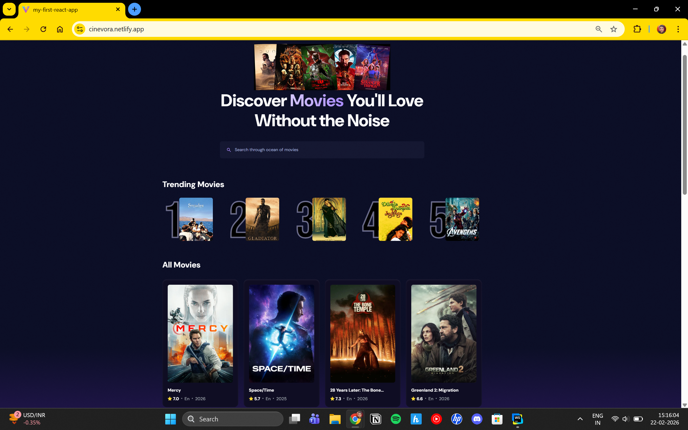
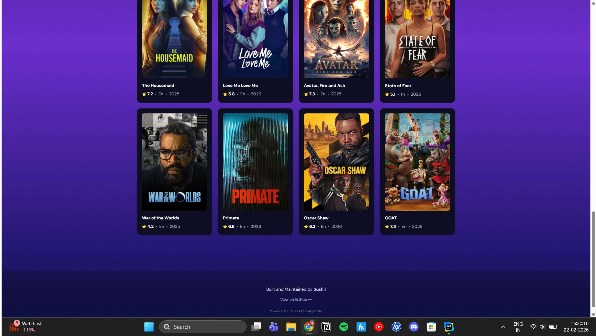

# 🎬 Cinevora

A modern movie discovery web application built using **React**, **Vite**, **Tailwind CSS**, **TMDB API**, and **Appwrite**.

Live Demo → https://cinevora.netlify.app/

---

## ✨ Features

- 🔎 Real-time movie search
- 🎬 Trending movies section
- ⚡ Debounced search for better performance
- 📊 Search analytics tracking with Appwrite
- 🌙 Modern dark UI design
- 📱 Fully responsive across devices
- 🚀 Deployed on Netlify

---

## 🛠 Tech Stack

- React
- Vite
- Tailwind CSS
- TMDB API
- Appwrite
- Netlify

---

## 📸 Preview




<br/>





---

## ⚙️ Installation & Setup

Clone the repository:

```bash
git clone https://github.com/YOUR_USERNAME/YOUR_REPO_NAME.git
cd my-first-react-app
```

## Install Dependencies

```bash
npm install
```

## Create a .env.local file in the root directory and add:

```bash
VITE_TMDB_API_KEY=your_tmdb_api_key
VITE_APPWRITE_PROJECT_ID=your_project_id
VITE_APPWRITE_DATABASE_ID=your_database_id
VITE_APPWRITE_COLLECTION_ID=your_collection_id
```

## Start development server:

```bash
npm run dev
```

## Build for production:

```bash
npm run build
```

## 📊 Appwrite Setup

This project uses Appwrite to:

- Track search counts

- Store trending movie metrics

Make sure you:

1. Create a project in Appwrite

2. Create a database

3. Create a collection (e.g., metrics)

4. Add required attributes:

    - searchTerm (string/text)

    - count (integer)

    - movie_id (string)

    - poster_url (string)

## 🤝 Contributing

Contributions, suggestions, and improvements are welcome.

If you'd like to:

Improve UI

Optimize performance

Add new features

Fix bugs

Feel free to fork the repo and create a pull request.

You can also open an issue to discuss ideas.

## 🚀 Deployment

The project is deployed using Netlify.

To deploy:

```bash 
npm run build
```

Then upload the dist folder to Netlify.

## 👨‍💻 Author

Created by Sushil Kumar Mishra

GitHub → https://github.com/Sushil2k4

## 📄 License

This project is open source and available under the MIT License.


---


```bash
git add .
git commit -m "Updated README with full documentation"
git push
